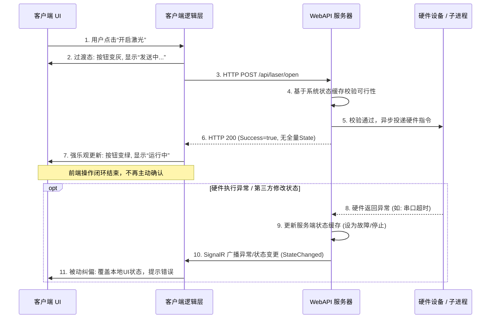

# 前后端交互逻辑：强乐观模式

## 概述

本方案针对硬件控制场景，提出一种**强乐观 UI 更新**与**后端缓存校验**相结合的前后端交互模式。核心思想是：前端在收到后端“命令已受理”的确认后，立即乐观地更新 UI 至目标状态，不再主动轮询确认；后端通过实时状态缓存验证命令可行性，并借助 SignalR 广播机制确保多客户端状态的最终一致性。

该模式旨在解决传统同步等待模式下的用户体验迟滞、网络超时盲区、服务端性能损耗及多客户端状态同步等问题。

## 交互流程总览



## 各阶段详细说明

### 阶段一：用户触发与前端过渡态（步骤 1-2）

- **用户动作**：在客户端 UI 上点击“开启激光”等控制按钮。
- **前端响应**：
  - 客户端逻辑层立即将按钮置为**过渡态**（如：按钮变灰，显示“发送中...”）。
  - 此状态仅表示“HTTP 请求已发出，正在等待网络响应”，**不表示正在等待硬件执行**。
- **设计意图**：防止用户重复点击，提供即时视觉反馈。

### 阶段二：后端校验与指令投递（步骤 3-5）

- **HTTP 请求**：前端发送 `POST /api/laser/open` 请求至 WebAPI。
- **服务端校验**：
  - WebAPI 收到请求后，首先查询内部的**系统状态缓存**（如 `SystemStateService`）。
  - 校验当前设备状态是否允许执行该命令（例如：设备是否已就绪、是否被占用等）。
  - 若校验不通过，立即返回错误响应，前端恢复按钮至初始态。
- **指令投递**：
  - 校验通过后，服务端将控制指令**异步投递**给底层硬件设备或子进程。
  - **关键设计**：投递成功后，服务端**不等待硬件实际执行结果**，立即准备 HTTP 响应。

### 阶段三：强乐观确认与 UI 终态更新（步骤 6-7）

- **极简 HTTP 响应**：服务端返回 HTTP 200，响应体为极简的 `CommandResult` 对象，仅包含 `Success=true` 等必要字段，**不包含全量系统状态**。
- **前端乐观更新**：
  - 前端解析响应，若 `Success` 为 `true`，则**直接认定硬件即将或已经成功执行**。
  - 立即将 UI 从过渡态切换至**确定态**（如：按钮变绿，显示“运行中”）。
- **操作闭环**：至此，前端认为本次操作已完成，**不再发起任何轮询或额外确认请求**。

### 阶段四：异常与状态变更的被动纠偏（步骤 8-11）

- **触发条件**：以下情况会触发服务端主动推送状态变更：
  1. 硬件执行过程中发生异常（如串口超时、硬件故障）。
  2. 其他客户端修改了设备状态。
  3. 设备受外部因素影响状态改变。
- **服务端处理**：
  - 硬件异常或状态变更事件到达服务端。
  - 服务端更新内部状态缓存，记录最新真实状态。
  - 通过 SignalR 向所有连接的客户端广播 `StateChanged` 事件，事件中携带**全量系统状态**。
- **前端纠偏**：
  - 客户端收到 SignalR 推送后，无条件使用推送的状态覆盖本地 UI 状态。
  - 若状态为异常，则显示相应的错误提示（如：按钮变红，显示“故障”）。
- **设计意图**：通过**被动监听**机制确保所有客户端 UI 与真实硬件状态最终一致，无需前端主动轮询。

## 关键设计原则

1. **前端强乐观**：信任后端基于缓存的校验结果，收到成功响应即视作操作成功，极大缩短用户感知延迟。
2. **后端强校验**：服务端作为“守门员”，基于实时状态缓存拦截非法或冲突请求，保证系统安全性。
3. **响应极简化**：HTTP 响应仅传递命令受理结果，避免传输全量状态带来的性能开销。
4. **状态广播化**：全局状态变更统一通过 SignalR 广播，保证多客户端实时同步，职责清晰。
5. **最终一致性**：接受极短时间内（1-2 秒）前端乐观状态与真实状态可能的不一致，以换取系统整体性能与简洁性。

## 技术实现要点

### 前端（以 React/Avalonia 为例）
```typescript
// 伪代码示例
async function handleOpenLaser() {
  // 1. 进入过渡态
  setButtonState('sending');

  try {
    // 2. 发送 HTTP 请求
    const result = await apiClient.post('/api/laser/open');
    
    if (result.success) {
      // 3. 强乐观更新
      setButtonState('running');
    } else {
      // 服务端校验未通过
      setButtonState('idle');
      showError(result.message);
    }
  } catch (networkError) {
    // HTTP 网络错误
    setButtonState('idle');
    showError('网络请求失败');
  }
}

// 4. 监听 SignalR 状态广播
signalRConnection.on('StateChanged', (fullState) => {
  // 无条件覆盖本地状态
  updateUIBasedOnState(fullState);
});
```

### 后端（ASP.NET Core WebAPI）
```csharp
// 伪代码示例
[HttpPost("laser/open")]
public async Task<IActionResult> OpenLaser()
{
    // 1. 基于缓存校验
    var cacheState = _systemStateCache.GetCurrentState();
    if (!cacheState.IsLaserReadyToOpen)
    {
        return Ok(new CommandResult { Success = false, Message = "设备忙或状态异常" });
    }

    // 2. 异步投递硬件指令（不等待执行结果）
    _ = Task.Run(() => _hardwareDriver.SendOpenCommand());

    // 3. 立即返回极简成功响应
    return Ok(new CommandResult { Success = true });
}

// 4. 硬件异常回调或状态变更处理
private void OnHardwareException(Exception ex)
{
    // 更新缓存
    _systemStateCache.MarkLaserAsFault();

    // 广播状态变更
    _signalRHub.Clients.All.SendAsync("StateChanged", _systemStateCache.GetFullState());
}
```

## 异常处理机制

| 异常场景 | 前端表现 | 后端处理 | 最终一致性保证 |
|---------|---------|---------|--------------|
| **网络请求失败**（HTTP 超时、断连） | 按钮恢复初始态，提示网络错误 | 无 | 前端状态回退，硬件状态不变 |
| **服务端校验不通过**（设备忙、状态冲突） | 按钮恢复初始态，提示具体原因 | 拦截请求，返回错误响应 | 状态一致，操作被拒绝 |
| **硬件执行异常**（串口超时、硬件故障） | 先乐观更新为“运行中”，1-2秒后 SignalR 纠偏为“故障” | 更新缓存，SignalR 广播 | 1-2 秒延迟后达到最终一致 |
| **多客户端操作冲突**（A 客户端开启，B 客户端同时关闭） | 各自乐观更新后，很快收到 SignalR 广播，UI 同步为最终状态 | 基于缓存序列化处理，广播最终状态 | 快速达到最终一致 |

## 优缺点总结

### 优势
1. **极致用户体验**：UI 响应瞬间完成，无感知等待。
2. **系统性能提升**：消除轮询请求，减少 HTTP 响应体积，降低服务端 GC 压力。
3. **架构简洁**：前后端职责清晰，SignalR 回归“状态广播”本源。
4. **多客户端同步**：通过广播机制天然支持多终端状态同步。

### 潜在挑战
1. **短暂的状态回闪（Jitter）**：乐观更新后，若硬件迅速失败，用户会先看到“成功”再看到“失败”，有短暂误导。这是为换取性能与简洁度接受的妥协。
2. **对后端缓存准确性要求高**：若缓存与真实硬件状态严重不一致，可能导致错误乐观更新。需确保缓存更新机制可靠。
3. **网络分区处理**：SignalR 断连期间，客户端可能无法及时收到状态纠偏。需配合连接状态提示与手动刷新机制。

## 适用场景

- **硬件控制类操作**（开启/关闭设备、调整参数等）。
- **多客户端需要实时同步状态的系统**。
- **对用户体验响应速度要求高的场景**。
- **可接受最终一致性的业务**。

---

*文档版本：1.0*  
*最后更新：2026-04-21*  
*基于“设备控制与状态管理双通道混合模式优化方案”细化而成*