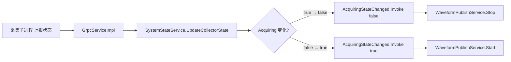

# 提交记录

> 生成时间：2026-04-29 09:57
> 仓库：数据采集与检测系统 V2.0
> 分支：`main`

---

## 一、Git 提交消息

```
refactor(mqtt): 波形发布与 RPC 通道职责分离，引入采集状态事件驱动启停
```

**正文：**

新建 `WaveformPublishService` 独立承担波形发布职责，从 `MqttRpcBackgroundService` 中剥离全部波形逻辑（-126 行）；新增 `SystemStateService.AcquiringStateChanged` 事件作为波形循环的唯一启停驱动源，替代原先散布在多处的手动 CTS 管理模式；`MqttEventPublisher` 新增 `PublishWaveformDataAsync` 统一双通道二进制波形发布入口。

---

## 二、本次提交详情

### 基本信息

| 字段 | 内容 |
|------|------|
| **提交时间** | 2026-04-29 09:57:46 |
| **作者** | NB11000 |
| **基于提交** | `e325981` — `feat: MQTT安全加固——TLS/SSL连接与EMQX集成` (2026-04-28 17:49) |
| **变更统计** | 8 files changed，751 insertions(+)，1358 deletions(-) |

### 变更文件清单

| 状态 | 文件路径 | 变更说明 |
|------|----------|----------|
| 新增 | `WebAPI/Service/WaveformPublishService.cs` | 波形发布后台服务（+202 行） |
| 修改 | `WebAPI/Service/MqttRpcBackgroundService.cs` | 剥离波形发布逻辑，纯 RPC 路由（-126 行，+3 行） |
| 修改 | `WebAPI/Service/MqttEventPublisher.cs` | 新增 `PublishWaveformDataAsync` 方法（+42 行） |
| 修改 | `WebAPI/Service/SystemStateService.cs` | 新增 `AcquiringStateChanged` 事件（+21 行） |
| 修改 | `WebAPI/Program.cs` | 注册 `WaveformPublishService`（+3 行） |
| 删除 | `MQTT RPC 主通道迁移计划.md` | 已完成实施，清理旧计划文档（-672 行） |
| 删除 | `MQTT RPC 集成计划.md` | 已完成实施，清理旧计划文档（-481 行） |
| 修改 | `提交记录/提交记录.md` | 更新提交记录文档（+562 行） |

---

## 三、背景（Background）

系统通过 MQTT 统一通信通道实现数据采集子进程与远程监控端的实时数据交互。采集子进程将双通道波形数据（每通道 1000 点 × `double` = 8KB，双通道合计 16KB/帧）写入共享内存，WebAPI 主控进程负责将波形帧高频发布到 MQTT 主题 `daq/{machineId}/waveform/ch1` 和 `daq/{machineId}/waveform/ch2`，供远程 UI 实时渲染。

在此次重构之前，波形发布循环完全嵌入在 `MqttRpcBackgroundService`（488 行）内部，与 MQTT RPC 请求路由、客户端生命周期管理混杂在同一类中。

---

## 四、问题（Problem）

### 1. 职责混乱 —— 违反单一职责原则

`MqttRpcBackgroundService` 的类注释已标注为"纯 RPC 路由职责"，但实际同时承担两条完全不同的职责链：

- **RPC 路由层**：构建方法路由表、解析 RPC 主题、分发 4 类 Handler 调用、发布 JSON 响应
- **波形发布层**：预分配双通道读写缓冲区、从 `ArrayPool` 租用字节缓冲、构建 MQTT 消息模板、运行 `PeriodicTimer` 波形发布循环（约 126 行）

### 2. 生命周期紧耦合

波形循环的 `CancellationTokenSource`（`_waveformCts`）由 `MqttRpcBackgroundService` 创建与销毁，启停逻辑散布在三个位置：

| 位置 | 操作 | 行数（旧） |
|------|------|-----------|
| `ConnectAsync()` 末尾 | 启动波形循环 (`new CancellationTokenSource()` → `PublishWaveformLoopAsync`) | 241–248 |
| `OnDisconnectedAsync()` | 取消波形循环 (`_waveformCts.Cancel()`) | 334 |
| `StopAsync()` | 取消波形循环 | 393 |

重连流程需要**先取消旧 `_waveformCts`，再 `Dispose`，再 `new` 新 CTS**——若任一步遗漏将导致对象泄漏或双重发布。

### 3. 状态盲区 —— 不检查采集状态就发布

波形发布循环在 MQTT 连接建立后**无条件启动**，不检查当前是否真正处于采集状态（`Acquiring == true`）：

```
MQTT Broker 断连重连 → ConnectAsync() → 启动波形循环
                                    ↑
                              未检查 Acquiring 状态
```

当采集子进程已停止采集，但 WebAPI 因 Broker 波动触发重连时，波形循环会在无数据的情况下空转发布零字节缓冲区，浪费带宽和 CPU。

### 4. 可维护性差

波形逻辑散落在 RPC 服务中，排查波形发布故障需要理解整个 MQTT 连接/重连上下文；无法对波形发布逻辑进行独立单元测试。

---

## 五、解决方案（Solution）

### 整体思路

**职责分离 + 事件驱动 + 统一发布入口** —— 将波形发布从 RPC 服务中彻底解耦，由采集状态事件自动驱动启停。

### 具体实施

#### 1. 新建 `WaveformPublishService`（`WebAPI/Service/WaveformPublishService.cs`，+202 行）

继承 `BackgroundService`，作为独立后台服务专责波形发布：

- **构造阶段**：预分配 `double[]` 读缓冲区（双通道各 1000 点）并租用 `byte[]` 发布缓冲区（复用），订阅 `SystemStateService.AcquiringStateChanged` 事件
- **`Start()`**：线程安全幂等（`lock` + `_isRunning` 双重检查），创建 `CancellationTokenSource` 并启动 `RunLoopAsync`
- **`Stop()`**：线程安全幂等，取消 CTS
- **`RunLoopAsync`**：`PeriodicTimer` 定时 → 共享内存读取 → `Buffer.BlockCopy` 零分配转换 → `MqttEventPublisher.PublishWaveformDataAsync` 发布
- `ExecuteAsync` 为空实现，完全由事件驱动

#### 2. `MqttRpcBackgroundService` 瘦身（-126 行）

- 移除全部波形相关成员：`_waveformBuf1/2`、`_ch1Bytes/_ch2Bytes`、`_waveformCts`、`_ch1Template/_ch2Template`、`WaveformFramePoints/WaveformFrameBytes` 常量、`PublishWaveformLoopAsync` 方法
- 注入 `WaveformPublishService`：
  - 重连成功时检查 `Acquiring` 状态 → `_waveformPublishService.Start()` 恢复发布
  - 断连时 → `_waveformPublishService.Stop()` 停止发布
- 类注释更新为"纯 RPC 路由职责"

#### 3. `SystemStateService` 新增事件通知（+21 行）

- 新增事件：`public event Action<bool>? AcquiringStateChanged`
- `UpdateCollectorState`：检测 `Acquiring` 新旧值变化时触发事件
- `ResetCollectorState`：`Acquiring` 从 `true` 变为 `false` 时触发事件



#### 4. `MqttEventPublisher` 新增波形发布方法（+42 行）

新增 `PublishWaveformDataAsync(byte[] ch1Payload, byte[] ch2Payload, int frameBytes)`：
- 发布到主题 `daq/{machineId}/waveform/ch1` 和 `daq/{machineId}/waveform/ch2`
- QoS 0（至多一次），允许高频丢帧以保证低延迟
- 双通道并行发布（`Task.WhenAll`）
- 失败时记录 Warning 日志，下次循环重试

#### 5. `Program.cs` 依赖注入注册（+3 行）

```csharp
builder.Services.AddSingleton<WaveformPublishService>();
builder.Services.AddHostedService<WaveformPublishService>(sp => sp.GetRequiredService<WaveformPublishService>());
```

### 效果对比

| 维度 | 重构前 | 重构后 |
|------|--------|--------|
| 波形发布职责 | 嵌入 `MqttRpcBackgroundService`（488行，含 ~126 行波形逻辑） | 独立 `WaveformPublishService`（202 行） |
| 启停方式 | 手动 CTS 管理，散布在 3 个位置 | 事件驱动，`AcquiringStateChanged` 自动触发 |
| 状态感知 | 不检查采集状态，重连即发布 | 仅在 `Acquiring == true` 时启动 |
| MQTT 发布入口 | RPC 服务内自行构建 `MqttApplicationMessage` | 统一经 `MqttEventPublisher.PublishWaveformDataAsync` |
| 可测试性 | 依赖完整 RPC 上下文 | 可独立对波形发布逻辑进行单元测试 |

---

## 六、未暂存变更

| 状态 | 文件 | 说明 |
|------|------|------|
| 未暂存 | `WebAPI/Service/WaveformPublishService.cs` | 新增注释 |
| 未暂存 | `WebAPI接口文档.md` | 新增问题讨论记录（+31 行） |
| 未跟踪 | `前后端交互逻辑-强乐观模式.md` | 新建设计文档 |
