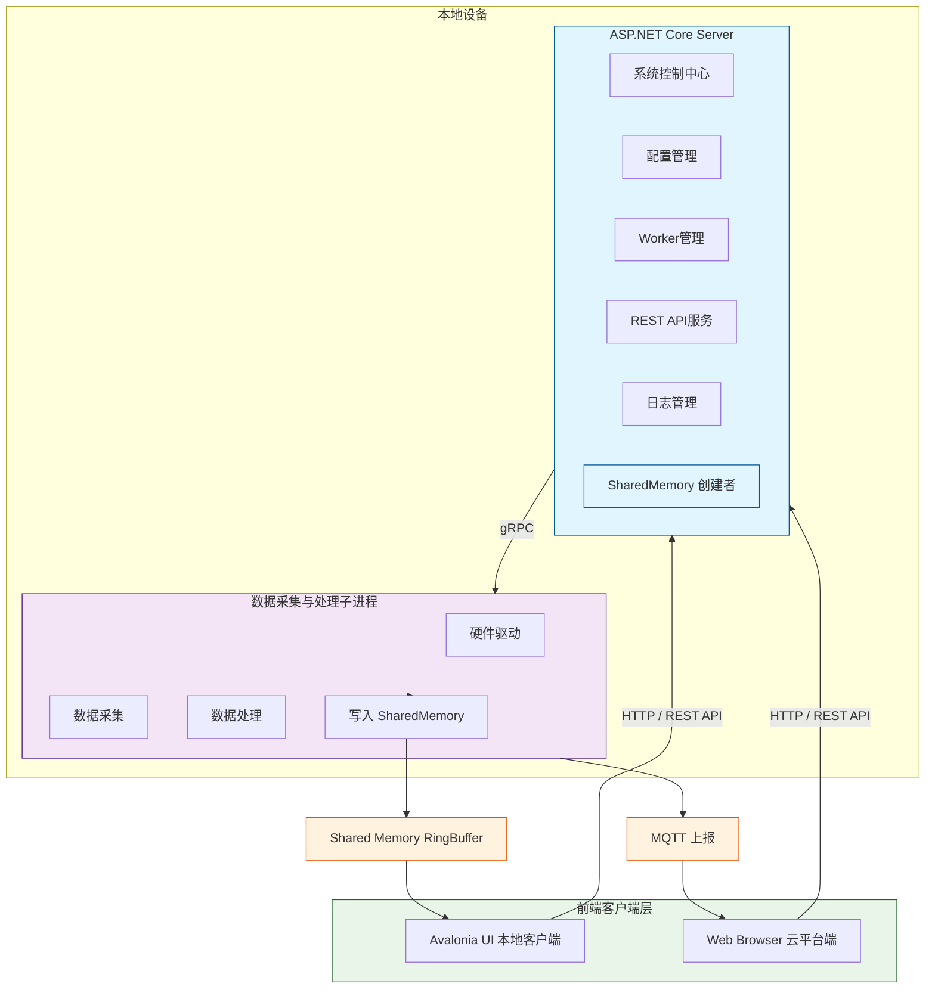

# 数据采集系统架构改进方案 (V3)

# 1. 设计目标

本系统用于工业数据采集与监测，需要满足以下目标：

## 1.1 架构目标

系统采用 前后端分离 + 采集代理架构。

**核心原则：**

- ASP.NET Core Server 作为系统控制中心

- DAQ Worker 负责数据采集

- UI 和 Browser 作为前端客户端

- 数据流与控制流分离

## 1.2 系统角色

系统包含三个核心组件：

|组件|职责|
|---|---|
|UI 客户端|实时数据显示|
|Browser|Web 管理界面|
|ASP.NET Server|系统控制中心|
|DAQ Worker|数据采集|
## 1.3 无状态 UI

**UI 设计原则：**

UI 是无状态客户端

UI 仅负责：

- 显示实时数据

- 发送控制命令

- 修改配置

- 查看日志

系统状态全部由：

**ASP.NET Core Server**

统一管理。

# 2. 系统总体架构

系统采用 三层进程架构。

```plain text
┌─────────────────────────────┐
│         前端客户端层          │
│    （本地）     （网上云平台） │
│  Avalonia UI    Web Browser │
└──────────────┬──────────────┘
               │
               │ HTTP / REST API
               │
               ▼
┌─────────────────────────────────────────────────┐
│                本地设备                           │
│                                                 │
│  ┌─────────────────────────────┐               │
│  │        ASP.NET Core Server   │               │
│  │                              │               │
│  │  系统控制中心                │               │
│  │  配置管理                    │               │
│  │  Worker管理                  │               │
│  │  API服务                     │               │
│  │  日志管理                    │               │
│  │                              │               │
│  │  SharedMemory 创建者         │               │
│  └──────────────┬──────────────┘               │
│                 │                               │
│                 │ gRPC                          │
│                 │                               │
│                 ▼                               │
│  ┌─────────────────────────────┐               │
│  │     数据采集与处理子进程       │               │
│  │                              │               │
│  │  硬件驱动                    │               │
│  │  数据采集                    │               │
│  │  数据处理                    │               │
│  │                              │               │
│  │  写入 SharedMemory           │               │
│  └──────────────┬──────────────┘               │
│          │                    │                 │
│          ▼                    ▼                 │
│   Shared Memory RingBuffer     MQTT             │
│          │                    │                 │
│          ▼                    ▼                 │
│     UI 直接读取数据         网上云平台           │
└─────────────────────────────────────────────────┘
```



# 3. 数据流与控制流分离

系统采用 Control Plane / Data Plane 分离架构。

## 3.1 控制流（Control Plane）

控制命令统一通过 ASP.NET Core Server。

```plain text
UI / Browser
        │
        │ REST API
        ▼
ASP.NET Core Server
        │
        │ gRPC
        ▼
DAQ Worker
```

**控制命令示例：**

- StartAcquisition

- StopAcquisition

- OpenDevice

- CloseDevice

- UpdateConfig

**Server 负责：**

- 接收客户端命令

- 校验参数

- 转发命令到 Worker

## 3.2 数据流（Data Plane）

高频数据采用 共享内存。

```plain text
DAQ Worker
      │
      │ Write
      ▼
SharedMemory
      │
      │ Read
      ▼
UI Client
```

**特点：**

- 零拷贝

- 极低延迟

- 避免 Server 成为瓶颈

# 4. 进程结构

系统运行进程如下：

```plain text
DAQ System
│
├── DaqServer.exe
│    ASP.NET Core
│
├── DaqWorker.exe
│    数据采集进程
│
├── DaqUI.exe
│    Avalonia UI
│
└── Web Browser
     Web UI
```

# 5. 各组件职责

## 5.1 ASP.NET Core Server

Server 是系统的 Backend 控制中心。

**负责：**

- 系统控制

- Worker管理

- 配置管理

- API服务

- 日志服务

**Server 功能模块**

- API Controller

- Command Dispatcher

- Worker Manager

- Config Manager

- Log Service

- SharedMemory Manager

**Worker 管理**

Server 负责：

- 启动 Worker

- 监控 Worker

- 重启 Worker

- 关闭 Worker

**SharedMemory 创建**

共享内存由 Server 创建：

MemoryMappedFile

Worker 与 UI 连接。

## 5.2 DAQ Worker

DAQ Worker 负责：

- 设备驱动

- 数据采集

- 数据预处理

- 写共享内存

Worker 不负责：

- UI

- 配置管理

- 系统控制

Worker 接收：

Server → gRPC 命令

## 5.3 UI Client

UI 是 无状态客户端。

**负责：**

- 显示波形

- 显示状态

- 发送命令

- 修改配置

- 查看日志

**UI 数据来源**

UI 直接读取共享内存：

SharedMemory → UI

**刷新频率：**

30Hz

**UI 控制命令**

UI 通过 API 发送命令：

- POST /api/acquisition/start

- POST /api/acquisition/stop

- GET  /api/status

- GET  /api/config

# 6. 通信协议设计

|通信路径|协议|
|---|---|
|UI → Server|HTTP REST|
|Browser → Server|HTTP REST|
|Server → Worker|gRPC|
|Worker → UI|SharedMemory|
# 7. 共享内存设计

共享内存用于：

实时波形数据

**结构：**

```plain text
SharedMemory
│
├─ Header
│   ├─ WriteIndex
│   ├─ ChannelCount
│   ├─ SampleRate
│
└─ RingBuffer
    ├─ Channel0
    ├─ Channel1
    └─ ChannelN
```

DAQ Worker：

写入

UI：

只读

# 8. UI 刷新机制

UI 使用定时器：

30Hz

**流程：**

```plain text
Timer
   │
读取最新数据
   │
降采样
   │
绘制波形
```

# 9. 系统启动流程

系统启动顺序：

1. Server 启动

2. Server 创建 SharedMemory

3. Server 启动 DAQ Worker

4. Worker 连接 gRPC

5. Worker 打开 SharedMemory

6. UI 启动

7. UI 连接 Server

8. UI 读取 SharedMemory

# 10. 异常恢复

- **UI 崩溃**：不影响采集

- **Worker 崩溃**Server：自动重启 Worker

- **Server 崩溃**Worker：自动退出

# 11. 项目结构建议

建议 solution 结构：

```plain text
DAQSystem
│
├── DaqServer
│    ASP.NET Core
│
├── DaqWorker
│    数据采集
│
├── DaqUI
│    Avalonia UI
│
├── DaqShared
│    公共模型
│
└── DaqProtocol
     gRPC协议
```

# 12. 架构优势

## 12.1 UI 无状态

UI 不保存系统状态。

## 12.2 Server 成为系统核心

所有控制统一由 Server 管理。

## 12.3 高性能数据通道

波形数据使用：

SharedMemory

避免网络开销。

## 12.4 支持 Web 系统

未来可以直接增加：

Web UI

无需修改 Worker。

## 12.5 工业级架构

系统采用：

Control Plane、Data Plane 架构。

# 13. 未来扩展

未来可增加：

- MQTT Worker

- Storage Worker

- Algorithm Worker

- AI Agent

**架构：**

```plain text
Server
 ├─ DAQ Worker
 ├─ MQTT Worker
 ├─ Algorithm Worker
 └─ Storage Worker
```

# 总结

通过将 Avalonia UI、ASP.NET Core Server 和 DAQ Worker 完全解耦，系统实现了：

- 清晰的职责分离

- 高性能数据传输

- 高可靠性

- 良好的扩展能力

ASP.NET Core Server 作为系统的 Backend 控制中心，统一管理所有 Worker 与系统状态。

UI 与 Browser 作为前端客户端，仅负责用户交互与数据展示，从而实现真正的 无状态客户端架构。
> （注：文档部分内容可能由 AI 生成）